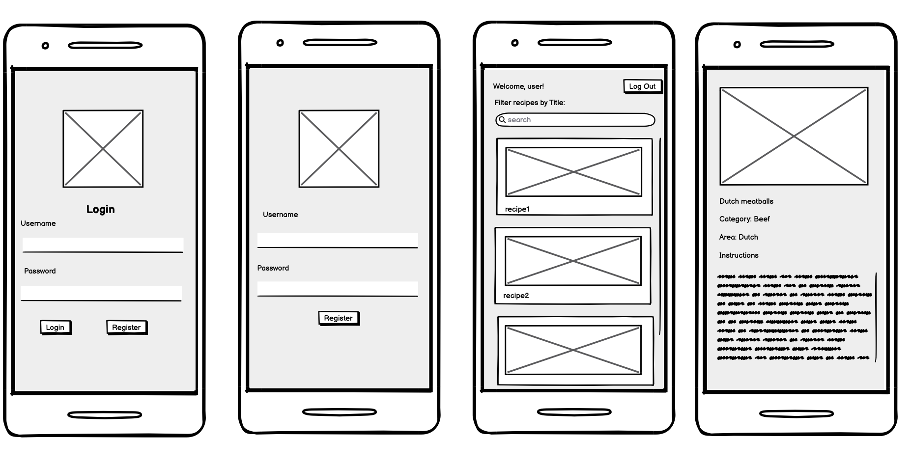

# Recipe Explorer App

## Table of Contents

1. [App Overview](#App-Overview)
2. [Product Spec](#Product-Spec)
3. [Wireframes](#Wireframes)
4. [Build Notes](#Build-Notes)

## App Overview

### Description

The Recipe Explorer App is a user-friendly platform designed to help users discover and explore a vast collection of recipes. With its intuitive interface, users can easily search based on recipe name. The app aims to simplify the process of finding and trying new recipes, providing users with a seamless experience to enhance their culinary adventures.

### App Evaluation

- **Category:** Lifestyle, Cooking, Food & Drink.
- **Mobile:** This app is primarily designed for mobile devices such as smartphones and tablets. It leverages features like search functionality, camera integration for uploading food images, and notifications for updates on favorite recipes or new additions to the collection.
- **Story:** Simplifies the process of discovering and trying new recipes by offering a comprehensive platform where users can effortlessly explore a diverse selection of culinary delights. From quick and easy weeknight meals to gourmet creations for special occasions, the app provides a wide range of recipes to suit every taste and occasion. Users can explore recipes by their titles.  
- **Market:** Targeted at cooking enthusiasts, foodies, and individuals interested in exploring new culinary experiences. Appeals to a wide range of users, from home cooks to professional chefs, who are passionate about cooking and experimenting with different cuisines.
- **Habit:** Users are encouraged to regularly browse the app for new recipe ideas, save their favorite recipes, and engage with the community by sharing their cooking adventures and feedback on recipes.
- **Scope:** Initially moderate with potential for scaling as the user base and recipe collection grow. Could start locally or regionally with potential to expand nationally or internationally, catering to a global audience of food lovers.

## Product Spec

### 1. User Features (Required and Optional)

**Required Features:**
- User registration, login and log out.
- Ability to scroll through a list of recipes and view basic information such as title and image. 
- Search and filter recipes by their titles.
- Recipe Details including photos,instructions, area, and category.

**Stretch Features:**
- Integration with online cooking classes or tutorials.
- Meal planning and grocery list generation.
- Community-driven recipe sharing and collaboration.
- Personalized meal recommendations based on user preferences.

### 2. Chosen API(s)

- **TheMealDB API**
  - Used to pull in a list of recipes available based on user preferences.

### 3. User Interaction

**Required Feature**

- **User selects preferences**
  - => Displays a personalized list of recipes matching the selected criteria(recipe title)
- **User clicks on the recipe**
  - => Displays detailed information about the recipe, including category, step-by-step instructions,and the country or region where the recipe originates from.
- **User login and register**
  - => Users can create accounts,sign in, and sign out of the app.

This spec outlines the core functionality and features of the Recipe Explorer App, designed to offer users a seamless and immersive experience in discovering, exploring, and experimenting with a wide variety of culinary delights.

This spec outlines the core functionality and features of the Petfinder App, aiming to create a seamless and engaging experience for users looking to adopt pets or provide babysitting services.
## Wireframes

### [BONUS] Digital Wireframes & Mockups

### [BONUS] Interactive Prototype

## Build Notes

Here's a place for any other notes on the app, it's creation 
process, or what you learned this unit!  

For Milestone 2, include **2+ Videos/GIFs** of the build process here!

## License

Copyright **2024** **Noely Guzman, Mary Ramirez, Maria Santos Perez, Nhi Nguyen, Hsu Khaing Zar Lwin**

Licensed under the Apache License, Version 2.0 (the "License");
you may not use this file except in compliance with the License.
You may obtain a copy of the License at

    http://www.apache.org/licenses/LICENSE-2.0

Unless required by applicable law or agreed to in writing, software
distributed under the License is distributed on an "AS IS" BASIS,
WITHOUT WARRANTIES OR CONDITIONS OF ANY KIND, either express or implied.
See the License for the specific language governing permissions and
limitations under the License.
